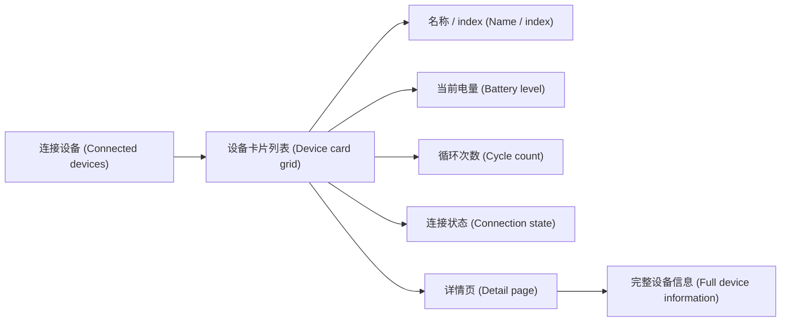

# AndroidTreeView

[-MIT-0E7A5F.svg)](LICENSE)
[](https://dotnet.microsoft.com/)
[](https://avaloniaui.net/)
[-Windows-0078D6.svg)](#windows-使用说明-windows-usage)
[&color=2F4858)](https://github.com/Birditch/AndroidTreeView/issues)
[&color=0E7A5F)](https://github.com/Birditch/AndroidTreeView/pulls)

**简体中文（默认 / Default）** | [English (README.en.md)](README.en.md) | [中文副本 (Chinese copy)](README-CN.md)

AndroidTreeView 是一个面向 Android 设备巡检、测试与管理的桌面应用 (desktop application)。它通过 ADB (Android Debug Bridge) 发现已连接设备，并以卡片 (card) 的形式展示设备名称或 index、当前电量、循环次数、连接状态等高频信息；点击设备卡片后，可以进入详情页 (detail page) 查看更完整的硬件、电池、系统、存储、网络、Root 与日志信息。

项目主体语言为简体中文 (Simplified Chinese)。文档、Issue 标签和社区协作材料均采用中文优先、英文括注的表达方式，方便中文社区使用，也便于英文读者快速理解项目边界。

> 当前状态 (Current status)：项目处于早期开发阶段。仓库已经具备开源基础文件、核心模型、ADB 解析与服务层、基础设施测试和项目契约文档；首个可安装版本仍在推进中。

<p align="center">
  <a href="https://github.com/Birditch/AndroidTreeView">
    
  </a>
</p>

## 项目定位 (Positioning)

AndroidTreeView 不是手机端应用，而是运行在电脑上的 Android 设备信息查看工具 (device information viewer)。它适合以下场景：

- 开发或测试过程中快速查看连接设备状态。
- 维修、实验室或 QA 环境中同时管理多台设备。
- 检查设备电量、电池循环次数、系统版本、存储和网络信息。
- 对未授权、离线、低电量、Root 等状态做清晰提示。
- 将零散的 ADB 输出整理成可扫描、可点击、可持续扩展的桌面界面。

## 核心功能 (Features)

- **设备卡片总览 (Device card overview)**：每台连接设备显示为一张卡片，展示设备名称 / index、型号、序列号、Android 版本、电量、充电状态、电池温度、循环次数、连接状态和最后刷新时间。
- **详情页 (Detail page)**：点击卡片进入单设备详情页，查看概览、硬件、电池、系统、存储、网络、Root、Logcat 和原始属性。
- **真实数据优先 (Real data first)**：循环次数等字段如果设备不提供，就显示不可用 (Unavailable)，不伪造、不猜测。
- **ADB 自动发现 (ADB discovery)**：支持手动配置路径、系统 PATH 和常见 Android SDK platform-tools 目录。
- **只读安全 (Read-only safety)**：只通过标准 ADB 命令读取信息，不刷写、不修改、不破坏设备。
- **中文默认 (Chinese by default)**：界面和开源协作材料以简体中文为主，同时保留英文括注。
- **主题与布局 (Theme & layout)**：规划支持浅色、深色、跟随系统和响应式卡片布局。
- **更新检查 (Update check)**：规划基于 GitHub Releases API 检查新版本，提示但不强制下载。

## 产品体验 (Product Experience)



主界面优先服务“扫一眼就知道发生了什么”的工作流。卡片只放高价值摘要信息，详情页承载完整数据，避免把总览页面堆成不可读的表格。

## 截图 (Screenshots)

> 截图占位 (Screenshots placeholder)：首个版本发布后在此补充实际界面截图，规划展示设备卡片总览、设备详情页与设置页。

<!-- 截图文件规划放置于 docs/screenshots/，例如：
| 设备卡片总览 | 设备详情页 | 设置页 |
| --- | --- | --- |
|  |  |  |
-->

## 技术栈 (Tech Stack)

- .NET 10 (`net10.0`)
- Avalonia 11
- CommunityToolkit.Mvvm
- Microsoft.Extensions.Hosting / DependencyInjection / Logging
- xUnit 与 .NET Test SDK
- ADB (Android Debug Bridge)

仓库结构 (Repository layout)：

```text
src/
  AndroidTreeView.Models
  AndroidTreeView.Core
  AndroidTreeView.Adb
  AndroidTreeView.Infrastructure
  AndroidTreeView.App
tests/
  AndroidTreeView.Core.Tests
  AndroidTreeView.Infrastructure.Tests
  AndroidTreeView.Adb.Tests
  AndroidTreeView.App.Tests
docs/
  architecture.md
  app-contract.md
  requirements-v1.md
```

## 安装与运行 (Installation)

首个正式版本发布后，将在 [Releases](https://github.com/Birditch/AndroidTreeView/releases) 提供安装包。当前阶段建议开发者从源码查看和参与：

```bash
git clone https://github.com/Birditch/AndroidTreeView.git
cd AndroidTreeView
dotnet restore AndroidTreeView.sln
dotnet test AndroidTreeView.sln
```

当前仓库仍在补齐桌面应用入口与 UI 集成。如果你在早期阶段直接运行 App 项目遇到入口点或 UI 未完成问题，请以 Issue 形式反馈，或先参考 `docs/architecture.md` 与 `docs/app-contract.md` 了解实现契约。

## ADB 与 USB 调试 (ADB & USB Debugging)

AndroidTreeView 依赖 Android SDK platform-tools 中的 `adb`。应用规划按以下顺序查找：

1. 设置中手动配置的 ADB 路径 (configured path)。
2. 系统 PATH 中的 `adb` / `adb.exe`。
3. 常见 SDK 目录，例如 `%LOCALAPPDATA%\Android\Sdk\platform-tools`、`ANDROID_HOME`、`ANDROID_SDK_ROOT`。

使用前请在手机上开启 USB 调试 (USB debugging)：

1. 打开设置中的关于手机 (About phone)，连续点击版本号 (Build number) 进入开发者模式。
2. 在开发者选项 (Developer options) 中开启 USB 调试 (USB debugging)。
3. 使用数据线连接电脑，并在手机上允许 USB 调试授权。
4. 如果设备显示未授权 (Unauthorized) 或离线 (Offline)，请重新授权、检查数据线或重启 ADB 服务。

> 完整的 platform-tools 安装与常见问题排错（Windows / macOS / Linux）见 [docs/adb-requirements.md](docs/adb-requirements.md)。

## Windows 使用说明 (Windows Usage)

Windows 是首个重点支持平台 (primary platform)。计划体验如下：

1. 启动 AndroidTreeView。
2. 如果未检测到 ADB，进入引导页选择 `adb.exe` 或安装 platform-tools。
3. 连接已开启 USB 调试的 Android 设备。
4. 在主界面查看设备卡片。
5. 点击卡片进入详情页查看更完整的数据。

## MSI 安装说明 (MSI Installation)

- 提供 **win-x64** 与 **win-x86** 两种架构的 MSI 安装包，使用 WiX Toolset v5 打包。
- MSI 会安装应用程序、必要文件与应用图标，并创建开始菜单快捷方式（可选桌面快捷方式）。
- 安装或运行需要 **.NET 10 桌面运行时**；若缺失，安装程序 / 应用会给出明确提示并引导安装。
- 本地打包 MSI 的脚本与详细步骤见 [docs/packaging.md](docs/packaging.md)。

## 自动更新说明 (Auto Update)

- 应用通过 GitHub Releases API（`/repos/Birditch/AndroidTreeView/releases/latest`）检查最新版本，并与当前版本做语义化比较。
- 检测到新版本时仅显示**非侵入式提示**，并提供按钮打开发布页面；**v1 不做自动下载 / 自动安装**。
- 可在 **设置 / 关于** 页手动点击“检查更新”。
- 无网络、接口失败、触发限流、无发布、已是最新等情况都会被安全处理，不会打断使用；是否在启动时自动检查可在设置中开关。

## 开发环境 (Development)

建议环境 (Recommended environment)：

- .NET 10 SDK
- Windows 10 / Windows 11
- JetBrains Rider、Visual Studio 或 VS Code
- Android SDK platform-tools

常用命令 (Common commands)：

```bash
dotnet restore AndroidTreeView.sln
dotnet build AndroidTreeView.sln
dotnet test AndroidTreeView.sln
```

当前已落地的测试重点覆盖 Core 与 Infrastructure；ADB 与 App 测试仍在继续补齐。

## 发布方式 (Publish & Release)

编译与测试命令见 [开发环境 (Development)](#开发环境-development)。发布自包含 (self-contained) 的 Windows 可执行文件：

```bash
# win-x64
dotnet publish src/AndroidTreeView.App -c Release -r win-x64 --self-contained true

# win-x86
dotnet publish src/AndroidTreeView.App -c Release -r win-x86 --self-contained true
```

- MSI 打包步骤见 [docs/packaging.md](docs/packaging.md)。
- CI 与发布工作流 (CI & release workflows) 会在桌面应用入口和打包链路稳定后启用；当前阶段请以本地 `dotnet test` 和模块级测试结果为准。

## 测试范围 (Test Scope)

目前测试所用机器均为摩托罗拉非中国大陆版本 (Motorola non-mainland China variants)。其他摩托罗拉版本、中国大陆版本、其他品牌设备、不同 Android 版本或不同连接方式如有问题，欢迎各位提起 Issue。

提交 Issue 时建议附上：

- 设备品牌与型号 (brand and model)。
- 地区或固件版本 (region or firmware variant)。
- Android 版本 (Android version)。
- 连接方式和 ADB 状态 (connection method and ADB state)。
- 截图、日志或可复现步骤 (screenshots, logs, or reproduction steps)。

## Issue 标签 (Issue Labels)

仓库维护一套中文优先的标签体系 (Chinese-first label taxonomy)，覆盖：

- 类型 (type)：缺陷、文档、功能增强、性能、问题。
- 状态 (status)：待分诊、需要复现、已接受、受阻。
- 优先级 (priority)：高、中、低。
- 范围 (area)：设备发现、设备卡片、详情页、电量、循环次数、连接、刷新、无障碍、界面。
- 硬件与地区 (hardware & region)：摩托罗拉、非中国大陆、中国大陆。

标签定义见 [.github/labels.yml](.github/labels.yml)。如果你的问题和设备兼容性有关，请优先提供设备与地区信息。

## 路线图 (Roadmap)

- [x] MIT 开源协议与社区文件。
- [x] 中文优先的 Issue 模板、PR 模板与标签体系。
- [x] 核心模型、ADB 解析器和基础设施测试。
- [ ] 桌面应用入口与依赖注入完整接入。
- [ ] 设备卡片总览界面。
- [ ] 设备详情页与分类数据视图。
- [ ] Logcat、Raw Properties 搜索与过滤。
- [ ] Windows 安装包与 GitHub Releases 发布流程。
- [ ] 更多设备品牌、地区版本与 Android 版本兼容性验证。

项目还在早期阶段，Stars 走势会随着版本发布、设备兼容性验证和社区反馈逐步变化：

<p align="center">
  <a href="https://starchart.cc/Birditch/AndroidTreeView">
    
  </a>
</p>

## 参与贡献 (Contributing)

欢迎提交 Issue 和 Pull Request。参与前请阅读：

- [贡献指南 (Contributing guide)](CONTRIBUTING.md)
- [支持说明 (Support guide)](SUPPORT.md)
- [安全策略 (Security policy)](SECURITY.md)
- [行为准则 (Code of conduct)](CODE_OF_CONDUCT.md)
- [Pull Request 模板 (Pull request template)](.github/PULL_REQUEST_TEMPLATE.md)

较大的功能建议建议先开 Issue 讨论设计方向，再进入实现。提交 PR 时请保持改动聚焦，并尽量补充测试或文档。

## 开源协议与致谢 (License & Acknowledgements)

AndroidTreeView 基于 [MIT License](LICENSE) 开源。你可以自由使用、复制、修改、合并、发布、分发、再授权和销售本软件的副本，但需要保留原始版权声明和许可证声明。

开源项目的成长离不开代码，也离不开工具、文档、构建系统和社区反馈。感谢 .NET、Avalonia、Android 与 ADB 生态提供的基础能力；感谢所有愿意提交 Issue、复现信息、测试结果和 Pull Request 的贡献者。

特别感谢 [JetBrains](https://www.jetbrains.com/community/opensource/) 对开源项目的支持，包括 JetBrains Rider 开源许可证 (open-source license) 等开发工具支持。这类支持让维护者能够以更稳定、更专业的方式持续推进项目。

<p align="center">
  <a href="https://www.jetbrains.com/community/opensource/">
    
  </a>
</p>
